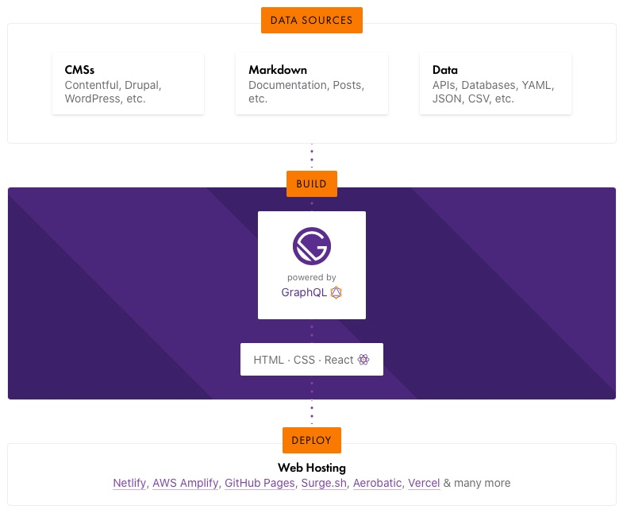
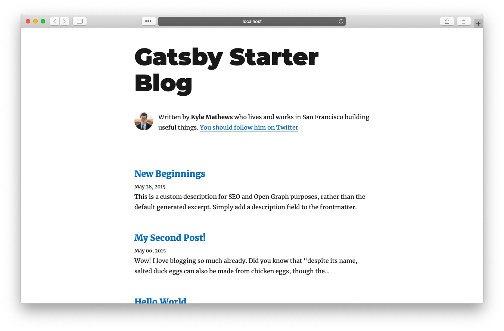
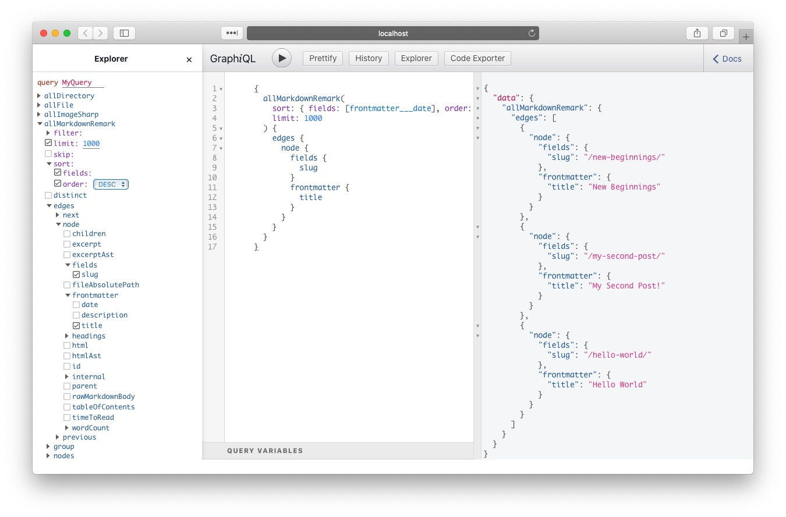
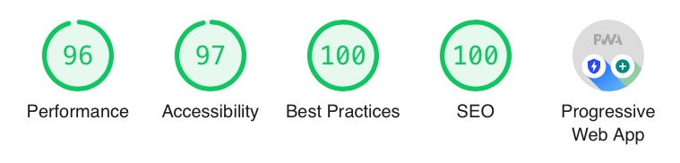

Llevo tiempo oyendo las ventajas de [Gatsby](https://www.gatsbyjs.org) como [generador de sitios web estáticos](https://www.staticgen.com) y como ejemplo de [Jamstack](https://jamstack.org). Así que una tarde me lancé con [el tutorial oficial](https://www.gatsbyjs.org/tutorial/). No me ayudó mucho 😇

Soy desarrollador web desde hace muchos años y, aunque estos últimos he estado más centrado en React Native, conozco las tecnologías de Gatsby. Decidí dar un enfoque más práctico a mi acercamiento. Decidí romper algo.

Lo que sigue son mis notas según desmontaba [Gatsby starter for creating blog](https://github.com/gatsbyjs/gatsby-starter-blog), posiblemente uno de los "packs de iniciación" a Gatsby más utilizados. 


## Primera impresión de Gatsby

> Gatsby is a free and open source framework based on React that helps developers build blazing fast websites and apps

De acuerdo, estoy en el sitio correcto.



La fortaleza de Gatsby está en poder utilizar diferentes fuentes de datos y mediante GraphQL alimentar a una aplicación en React. Generamos una versión estática y listo.

Sinceramente utilizar GraphQL para "simplemente" leer de ficheros parece matar moscas a cañonazos. Pero tanto GraphQL como "blazing fast" son dos términos de moda.


## Primeros pasos

Toda historia comienza con una instalación

```bash
npm install --global gatsby-cli
```

continúa con la presentación del personaje principal, **gastby-starter-blog**,

```bash{outputLines: 2-100}
gatsby new blog https://github.com/gatsbyjs/gatsby-starter-blog

info Creating new site from git:
Cloning into 'blog'...
remote: Enumerating objects: 40, done.
remote: Counting objects: 100% (40/40), done.
remote: Compressing objects: 100% (33/33), done.
remote: Total 40 (delta 1), reused 23 (delta 0), pack-reused 0
Unpacking objects: 100% (40/40), done.
success Created starter directory layout
info Installing packages...
yarn install v1.22.4
[1/4] 🔍  Resolving packages...
[2/4] 🚚  Fetching packages...
[3/4] 🔗  Linking dependencies...
warning "gatsby > @pmmmwh/react-refresh-webpack-plugin@0.3.1" has incorrect peer dependency "react-refresh@^0.8.2".
warning "gatsby > @typescript-eslint/eslint-plugin > tsutils@3.17.1" has unmet peer dependency "typescript@>=2.8.0 || >= 3.2.0-dev || >= 3.3.0-dev || >= 3.4.0-dev || >= 3.5.0-dev || >= 3.6.0-dev || >= 3.6.0-beta || >= 3.7.0-dev || >= 3.7.0-beta".
[4/4] 🔨  Building fresh packages...
success Saved lockfile.
✨  Done in 40.68s.
info Initialising git in blog
Initialized empty Git repository in /Users/chernando/Work/blog/.git/
info Create initial git commit in blog
info
Your new Gatsby site has been successfully bootstrapped. Start developing it by
running:

  cd blog
  gatsby develop
```

nos enfrenta al reto de seguir las instrucciones

```bash{outputLines: 3-100}
cd blog
gatsby develop
success open and validate gatsby-configs - 0.066s
success load plugins - 5.934s
warn The Google Analytics plugin requires a tracking ID. Did you mean to add it?
success onPreInit - 0.036s
success initialize cache - 0.069s
success copy gatsby files - 0.100s
warn gatsby-plugin-feed was initialized in gatsby-config.js without a feeds
option.
This means that the plugin will use the internal RSS feed creation, which may
not match your use case.
success onPreBootstrap - 0.030s
success createSchemaCustomization - 0.136s
success source and transform nodes - 0.146s
success building schema - 0.430s
success createPages - 0.048s
success createPagesStatefully - 0.093s
success onPreExtractQueries - 0.002s
success update schema - 0.051s
success extract queries from components - 0.507s
success write out requires - 0.060s
success write out redirect data - 0.002s
success Build manifest and related icons - 0.183s
success onPostBootstrap - 0.194s
⠀
info bootstrap finished - 13.572s
⠀
success run queries - 0.616s - 9/9 14.61/s
success Generating image thumbnails - 3.313s - 9/9 2.72/s
⠀
You can now view gatsby-starter-blog in the browser.
⠀
  http://localhost:8000/
⠀
View GraphiQL, an in-browser IDE, to explore your site's data and schema
⠀
  http://localhost:8000/___graphql
⠀
Note that the development build is not optimized.
To create a production build, use gatsby build
⠀
success Building development bundle - 6.151s
```

y termina con nuestro blog.



El Sr. Mathews se ha tomado la molestia de preprararnos un blog. Veamos qué nos propone.


## Estructura de un proyecto Gatsby

```bash{outputLines: 2-100}
git ls-files
.gitignore
.prettierignore
.prettierrc
LICENSE
README.md
content/assets/gatsby-icon.png
content/assets/profile-pic.jpg
content/blog/hello-world/index.md
content/blog/hello-world/salty_egg.jpg
content/blog/my-second-post/index.md
content/blog/new-beginnings/index.md
gatsby-browser.js
gatsby-config.js
gatsby-node.js
package.json
src/components/bio.js
src/components/layout.js
src/components/seo.js
src/pages/404.js
src/pages/index.tsx
src/templates/blog-post.js
src/utils/typography.js
static/favicon.ico
static/robots.txt
yarn.lock
```

A grandes rasgos:

 * `content` es la fuente de ficheros para GraphQL,
 * `gatsby-*.js` son ficheros de configuración del propio Gatsby,
 * `src` es código de React de nuestra aplicación, y
 * `static` son los ficheros que no necesitan ser procesados.

[La documentación oficial](https://www.gatsbyjs.org/docs/gatsby-project-structure/) añade poco más.


## Cómo son los contenidos

Dentro de la carpeta `contents` encontramos dos tipos de ficheros:

* imágenes, y
* Markdown.

Las imágenes veremos luego que pueden ser procesadas. Pero aquí no tienen ningún tratamiento especial.

Los ficheros Markdown siguen el estándar, con el frontmatter para sus metadatados:

```bash{outputLines: 2-10}
head content/blog/hello-world/index.md
---
title: Hello World
date: "2015-05-01T22:12:03.284Z"
description: "Hello World"
---

This is my first post on my new fake blog! How exciting!

I'm sure I'll write a lot more interesting things in the future.
```

## Ficheros de configuración de Gatsby

Empecemos con el que parece el principal, `gatsby-config`.

La documentación oficial https://www.gatsbyjs.org/docs/gatsby-config/ por si necesitas alguna referencia.

### gastby-config.js

```js
module.exports = {
  siteMetadata: {
    ...
  },
  plugins: [
    ...
  ],
}
```

`siteMetada` es una fuente de datos estática dedicada al propio sitio web. Aunque es un estándar dentro de Gatsby parece que no hay ninguna convención establecida para sus campos.

```js
module.exports = {
// highlight-start
  siteMetadata: {
    title: `Gatsby Starter Blog`,
    author: {
      name: `Kyle Mathews`,
      summary: `who lives and works in San Francisco building useful things.`,
    },
    description: `A starter blog demonstrating what Gatsby can do.`,
    siteUrl: `https://gatsby-starter-blog-demo.netlify.com/`,
    social: {
      twitter: `kylemathews`,
    },
  },
// highlight-end
  plugins: [
    ...
  ],
}
```

`plugins` lista los plugins instalados. Estos mismos plugins están reflejados en el fichero `package.json`. Cada `plugin` o bien es un nombre o bien tiene este formato:

```js
{
  resolve: `nombre`,
  options: { ... },
}
```

y su orden puede importar.

```js
module.exports = {
  siteMetadata: {
    title: `Gatsby Starter Blog`,
    author: {
      name: `Kyle Mathews`,
      summary: `who lives and works in San Francisco building useful things.`,
    },
    description: `A starter blog demonstrating what Gatsby can do.`,
    siteUrl: `https://gatsby-starter-blog-demo.netlify.com/`,
    social: {
      twitter: `kylemathews`,
    },
  },
//highlight-start
  plugins: [
    {
      resolve: `gatsby-source-filesystem`,
      options: {
        path: `${__dirname}/content/blog`,
        name: `blog`,
      },
    },
    {
      resolve: `gatsby-source-filesystem`,
      options: {
        path: `${__dirname}/content/assets`,
        name: `assets`,
      },
    },
    {
      resolve: `gatsby-transformer-remark`,
      options: {
        plugins: [
          {
            resolve: `gatsby-remark-images`,
            options: {
              maxWidth: 590,
            },
          },
          {
            resolve: `gatsby-remark-responsive-iframe`,
            options: {
              wrapperStyle: `margin-bottom: 1.0725rem`,
            },
          },
          `gatsby-remark-prismjs`,
          `gatsby-remark-copy-linked-files`,
          `gatsby-remark-smartypants`,
        ],
      },
    },
    `gatsby-transformer-sharp`,
    `gatsby-plugin-sharp`,
    {
      resolve: `gatsby-plugin-google-analytics`,
      options: {
        //trackingId: `ADD YOUR TRACKING ID HERE`,
      },
    },
    `gatsby-plugin-feed`,
    {
      resolve: `gatsby-plugin-manifest`,
      options: {
        name: `Gatsby Starter Blog`,
        short_name: `GatsbyJS`,
        start_url: `/`,
        background_color: `#ffffff`,
        theme_color: `#663399`,
        display: `minimal-ui`,
        icon: `content/assets/gatsby-icon.png`,
      },
    },
    `gatsby-plugin-react-helmet`,
    {
      resolve: `gatsby-plugin-typography`,
      options: {
        pathToConfigModule: `src/utils/typography`,
      },
    },
    // this (optional) plugin enables Progressive Web App + Offline functionality
    // To learn more, visit: https://gatsby.dev/offline
    // `gatsby-plugin-offline`,
  ],
//highlight-end
}
```


#### Plugins de gatsby-starter-blog

* `gastby-source-filesystem` alimenta con ficheros el GraphQL.
* `gastby-transformer-remark` procesa Markdown para Gatsby, lee ficheros desde la fuente anterior. Incluye otros plugins para mejorar su procesamiento:
  * `gatsby-remark-images` para tratar las imagenes, concretamente sus huecos en HTML, esto hará la experiencia del sitio web más fluida.
  * `gastby-remark-responsive-iframe` para los `<iframes>`.
  * `gatsby-remark-prismjs` colorea el código fuente.
  * `gastby-remark-copy-linked-files` copia ficheros enlazados desde Markdown.
  * `gastby-remark-smartypants` pasa de "" a "comillas elegantes".
* `gastby-transformer-sharp` el transformador para las imágenes. Nos permite procesarlas en diferentes tamaños, efectos, resoluciones, etc.
* `gastby-plugin-sharp` me pregunto qué relación tendrá con el anterior 🤔.
* `gastby-plugin-google-analytics` evidente.
* `gastby-plugin-feed` genera el RSS del sitio. Tiene un warning en el `gatsby develop` ⚠️.
* `gastby-plugin-manifest` genera el `manifest`, necesario para tener una Pogressive Web Application (PWA).
* `gastby-plugin-react-helmet` nos da acceso a [React Helmet](https://github.com/nfl/react-helmet). React Helmet permite modificar las cabeceras del documento HTML, principalmente para mejorar el SEO.
* `gastby-plugin-typography` para utilizar [Typography](https://kyleamathews.github.io/typography.js/). Para dar estilo al sitio web.
* `gastby-plugin-offline` desactivado  de fábrica (me pregunto por qué). Pero si puedo hacer mi sitio web offline descomentando una línea... 🤩

Es una lista bastante completa de funcionalidad de partida.


### gatsby-browser.js

```js
// custom typefaces
import "typeface-montserrat"
import "typeface-merriweather"

import "prismjs/themes/prism.css"
```

Vale ya hemos visto un par de plugins relacionados:

* `gatsby-plugin-typography` y aquí importamos dos de sus tipografías.
* `gatsby-remark-prismjs` y aquí elegimos uno de los temas para colorear el código fuente.


### gastby-node.js

¡Por fin algo de código!

```js
const path = require(`path`)
const { createFilePath } = require(`gatsby-source-filesystem`)

exports.createPages = async ({ graphql, actions }) => {
  // ...
}

exports.onCreateNode = ({ node, actions, getNode }) => {
  // ...
}
```

Exporta dos funciones:
* createPages, y
* onCreateNode.

Encaja con la [documentación principal](https://www.gatsbyjs.org/docs/node-apis/):
* generación de páginas dinámicas, y
* responder a eventos durante la construcción (la creación de un nodo).

Veamos la más corta, `onCreateNode`:

```js
const path = require(`path`)
const { createFilePath } = require(`gatsby-source-filesystem`)

exports.createPages = async ({ graphql, actions }) => {
  // ...
}

// highlight-start
exports.onCreateNode = ({ node, actions, getNode }) => {
  const { createNodeField } = actions

  if (node.internal.type === `MarkdownRemark`) {
    const value = createFilePath({ node, getNode })
    createNodeField({
      name: `slug`,
      node,
      value,
    })
  }
}
// highlight-end
```

Es un listener de eventos tipo `onCreateNode`, que se generan en el [Redux de Gatsby](https://github.com/gatsbyjs/gatsby/blob/master/packages/gatsby/src/redux/actions/public.js#L900-L905), y la estructura de un node ([definida aquí](https://github.com/gatsbyjs/gatsby/blob/56c7f056b2234f6cc48badd53206cd881d99ce60/packages/gatsby/src/joi-schemas/joi.ts#L94-L114)) aclara la condición del `if` sin embargo no encuentro (o me he aburrido de buscar) la referencia del actions y getNode.

`createFilePath` es una utilidad del plugin `gatsby-source-filesystem` que permite obtener el nombre del fichero que está detrás del nodo. Por ejemplo `content/blog/hello-world/index.md` se convierte en `/hello-world/`.

`createNodeField` extiende el node añadiendo una propiedad. En este caso pedimos añadir al node el campo `slug` con el valor obtenido de `createFilePath`

Básicamente con todo este código estamos auto generando el campo `slug`.

Volvamos al principal empezando por la parte de GraphQL:

```graphql
      {
        allMarkdownRemark(
          sort: { fields: [frontmatter___date], order: DESC }
          limit: 1000
        ) {
          edges {
            node {
              fields {
                slug
              }
              frontmatter {
                title
              }
            }
          }
        }
      }
```

Por suerte tenemos un explorador de GraphQL gratis en http://localhost:8000/___graphql



Estamos utilizando la fuerte de datos de Remark, es decir los ficheros .md que Remark ha encontrado. A partir de él buscamos por el `edges`. ¿Por qué `edges` y no `nodes` directamente? Ni idea. Por cada nodo sacamos su slug (que vimos antes añadir en fields con `onCreateNodeFiled`) y el título que definimos en el frontmatter del .md.

Sigamos con el resto del código:

```js
exports.createPages = async ({ graphql, actions }) => {
  const { createPage } = actions

  const blogPost = path.resolve(`./src/templates/blog-post.js`)
  const result = await graphql(
    `...`
  )

  if (result.errors) {
    throw result.errors
  }

// highlight-start
  // Create blog posts pages.
  const posts = result.data.allMarkdownRemark.edges

  posts.forEach((post, index) => {
    const previous = index === posts.length - 1 ? null : posts[index + 1].node
    const next = index === 0 ? null : posts[index - 1].node

    createPage({
      path: post.node.fields.slug,
      component: blogPost,
      context: {
        slug: post.node.fields.slug,
        previous,
        next,
      },
    })
  })
}
// highlight-end

exports.onCreateNode = ({ node, actions, getNode }) => {
  const { createNodeField } = actions

  if (node.internal.type === `MarkdownRemark`) {
    const value = createFilePath({ node, getNode })
    createNodeField({
      name: `slug`,
      node,
      value,
    })
  }
}
```

Para cada nodo encontrado en la consulta:
  * Establecemos un "entrada anterior" y "entrada siguiente" para añadirla al contexto de la página.
  * Creamos una página utilizando como path para la URL el slug, recordemos `/hello-world/`.
  * Utilizamos un componente React, `blogPost`, para renderizar su contenido.

Viendo las dependencias de tener el campos `slug` tiene sentido pensar que primero se crean los nodos y posteriormente se llama a `createPages`.

Ya que tenemos un referencia a `blog-post` saltemos a la carpeta `src`.

## Ficheros en `src`

En este directorio encontramos el código de la aplicación React.

## templates/blog-post.js

Y hemos conseguido llegar a código de React:

```jsx
import React from "react"
import { Link, graphql } from "gatsby"

import Bio from "../components/bio"
import Layout from "../components/layout"
import SEO from "../components/seo"
import { rhythm, scale } from "../utils/typography"

const BlogPostTemplate = ({ data, pageContext, location }) => {
  // ...
}

export default BlogPostTemplate

export const pageQuery = graphql`
  // ...
`
```

`pageQuery` es una convención de Gatsby que utiliza en la generación de páginas para rellenar el prop `data` del componente.

Descompongamos la query en GraphQL para entender ese `data`:

```graphql
  query BlogPostBySlug($slug: String!) {
    site {
      siteMetadata {
        title
      }
    }
    markdownRemark(fields: { slug: { eq: $slug } }) {
      id
      excerpt(pruneLength: 160)
      html
      frontmatter {
        title
        date(formatString: "MMMM DD, YYYY")
        description
      }
    }
  }
```

Sacamos información de dos fuentes diferentes:
* del siteMetadata que vimos en el `gatsby-config`, y
* markdownRemark que busca de entre todos los markdowns el fichero que tenga `$slug`.

El campo slug viene de fields, así que lo hemos creado en `onCreateNode`. Pero ¿cómo lo pasamos como parámetro en la query?.

[La documentación oficial](https://www.gatsbyjs.org/docs/page-query/#how-to-add-query-variables-to-a-page-query) define que todo lo que pongamos en el `pageContext` se puede utilizar como filtro. Esto explica el motivo de volver a pasar el slug en `createPages`.

Veamos el componente de React:

```jsx
const BlogPostTemplate = ({ data, pageContext, location }) => {
  const post = data.markdownRemark
  const siteTitle = data.site.siteMetadata.title
  const { previous, next } = pageContext

  return (
    <Layout location={location} title={siteTitle}>
      <SEO
        title={post.frontmatter.title}
        description={post.frontmatter.description || post.excerpt}
      />
      <article>
        <header>
          <h1
            style={{
              marginTop: rhythm(1),
              marginBottom: 0,
            }}
          >
            {post.frontmatter.title}
          </h1>
          <p
            style={{
              ...scale(-1 / 5),
              display: `block`,
              marginBottom: rhythm(1),
            }}
          >
            {post.frontmatter.date}
          </p>
        </header>
        <section dangerouslySetInnerHTML={{ __html: post.html }} />
        <hr
          style={{
            marginBottom: rhythm(1),
          }}
        />
        <footer>
          <Bio />
        </footer>
      </article>

      <nav>
        <ul
          style={{
            display: `flex`,
            flexWrap: `wrap`,
            justifyContent: `space-between`,
            listStyle: `none`,
            padding: 0,
          }}
        >
          <li>
            {previous && (
              <Link to={previous.fields.slug} rel="prev">
                ← {previous.frontmatter.title}
              </Link>
            )}
          </li>
          <li>
            {next && (
              <Link to={next.fields.slug} rel="next">
                {next.frontmatter.title} →
              </Link>
            )}
          </li>
        </ul>
      </nav>
    </Layout>
  )
}
`
```

La función principal es un componente funcional de React con:
* `data` que viene de la consulta de GraphQL,
* `pageContext` que rellenamos con `createPage`, y
* `location`, que viene gratis por parte de Gatsby.

Los componentes de `<Layout>`, `<SEO>` y `<Bio>` son locales del proyecto, que también es código React normal. Y luego tenemos `<Link>`:

```js
              <Link to={previous.fields.slug} rel="prev">
                ← {previous.frontmatter.title}
              </Link>
```

Recordemos que al ser una aplicación React necesitamos un router para cambiar de páginas. Al mismo tiempo estas generando un sitio estático. Gatsby nos proporciona este componete, [<Link>](https://www.gatsbyjs.org/docs/gatsby-link/) para conseguir ambas cosas.

Vale, veamos qué nos propone el Sr. Mathews en `<Layout>`.

### src/components/layout.js

```js
import React from "react"
import { Link } from "gatsby"

import { rhythm, scale } from "../utils/typography"

const Layout = ({ location, title, children }) => {
  const rootPath = `${__PATH_PREFIX__}/`  // highlight-line
  let header

  if (location.pathname === rootPath) {
    header = (
      <h1
        style={{
          ...scale(1.5),
          marginBottom: rhythm(1.5),
          marginTop: 0,
        }}
      >
        <Link
          style={{
            boxShadow: `none`,
            color: `inherit`,
          }}
          to={`/`}
        >
          {title}
        </Link>
      </h1>
    )
  } else {
    header = (
      <h3
        style={{
          fontFamily: `Montserrat, sans-serif`,
          marginTop: 0,
        }}
      >
        <Link
          style={{
            boxShadow: `none`,
            color: `inherit`,
          }}
          to={`/`}
        >
          {title}
        </Link>
      </h3>
    )
  }
  return (
    <div
      style={{
        marginLeft: `auto`,
        marginRight: `auto`,
        maxWidth: rhythm(24),
        padding: `${rhythm(1.5)} ${rhythm(3 / 4)}`,
      }}
    >
      <header>{header}</header>
      <main>{children}</main>
      <footer>
        © {new Date().getFullYear()}, Built with
        {` `}
        <a href="https://www.gatsbyjs.org">Gatsby</a>
      </footer>
    </div>
  )
}

export default Layout
```

A destacar __PATH_PREFIX__, una variable mágica declarada [durante la generación del sitio](https://github.com/gatsbyjs/gatsby/blob/36357ab81e931c27ec0b781193909d31ac434a65/packages/gatsby/src/utils/webpack.config.js#L198), que identifica la raíz del sitio. En este caso la utilizamos para saber si estamos renderizando una página principal de las demás entradas del blog.

Poco más a destacar.

### src/components/seo.js

```js
/**
 * SEO component that queries for data with
 *  Gatsby's useStaticQuery React hook
 *
 * See: https://www.gatsbyjs.org/docs/use-static-query/
 */

import React from "react"
import PropTypes from "prop-types"
import { Helmet } from "react-helmet"
import { useStaticQuery, graphql } from "gatsby"

const SEO = ({ description, lang, meta, title }) => {
// highlight-start
  const { site } = useStaticQuery(
    graphql`
      query {
        site {
          siteMetadata {
            title
            description
            social {
              twitter
            }
          }
        }
      }
    `
  )
// highlight-end

  const metaDescription = description || site.siteMetadata.description

  return (
    <Helmet
      htmlAttributes={{
        lang,
      }}
      title={title}
      titleTemplate={`%s | ${site.siteMetadata.title}`}
      meta={[
        {
          name: `description`,
          content: metaDescription,
        },
        {
          property: `og:title`,
          content: title,
        },
        {
          property: `og:description`,
          content: metaDescription,
        },
        {
          property: `og:type`,
          content: `website`,
        },
        {
          name: `twitter:card`,
          content: `summary`,
        },
        {
          name: `twitter:creator`,
          content: site.siteMetadata.social.twitter,
        },
        {
          name: `twitter:title`,
          content: title,
        },
        {
          name: `twitter:description`,
          content: metaDescription,
        },
      ].concat(meta)}
    />
  )
}

SEO.defaultProps = {
  lang: `en`,
  meta: [],
  description: ``,
}

SEO.propTypes = {
  description: PropTypes.string,
  lang: PropTypes.string,
  meta: PropTypes.arrayOf(PropTypes.object),
  title: PropTypes.string.isRequired,
}

export default SEO
```

A parte de envolver a React Helmet para añadir las caberaras necesarias para un buen SEO vemos `useStaticQuery`.

`useStaticQuery` es el hook equivalente a `pageQuery` que veíamos antes en el template de blog-post. Imagino que el autor quiere mostrarnos diferentes caminos para llegar al mismo sitio.

También podemos ver, que al ser un componente de React, podemos utilizar `propTypes`. Personalmente prefiero utilizar TypeScript para esto.

### src/components/bio.js

```js
/**
 * Bio component that queries for data
 * with Gatsby's useStaticQuery component
 *
 * See: https://www.gatsbyjs.org/docs/use-static-query/
 */

import React from "react"
import { useStaticQuery, graphql } from "gatsby"
import Image from "gatsby-image" // highlight-line

import { rhythm } from "../utils/typography"

const Bio = () => {
  const data = useStaticQuery(graphql`
    query BioQuery {
// highlight-start
      avatar: file(absolutePath: { regex: "/profile-pic.jpg/" }) {
        childImageSharp {
          fixed(width: 50, height: 50) {
            ...GatsbyImageSharpFixed
          }
        }
      }
// highlight-end
      site {
        siteMetadata {
          author {
            name
            summary
          }
          social {
            twitter
          }
        }
      }
    }
  `)

  const { author, social } = data.site.siteMetadata
  return (
    <div
      style={{
        display: `flex`,
        marginBottom: rhythm(2.5),
      }}
    >
    // highlight-start
      <Image
        fixed={data.avatar.childImageSharp.fixed}
    // highlight-end
        alt={author.name}
        style={{
          marginRight: rhythm(1 / 2),
          marginBottom: 0,
          minWidth: 50,
          borderRadius: `100%`,
        }}
        imgStyle={{
          borderRadius: `50%`,
        }}
      />
      <p>
        Written by <strong>{author.name}</strong> {author.summary}
        {` `}
        <a href={`https://twitter.com/${social.twitter}`}>
          You should follow him on Twitter
        </a>
      </p>
    </div>
  )
}

export default Bio
```

Lo más interesante es la parte de la consulta para obtener la imagen procesada por Sharp y la utilización de `<Image>` de Gatsby.

1. El filtro encuentra un fichero en concreto `profile-pic.jpg`.
2. Utilizamos el fragmento `...GatsbyImageSharpFixed` que actua como una macro, es decir se sustituye por el resto de la consulta. En este caso vamos a obtener toda la información que necesitamos para gestionar una [imagen de tamaño fijo](https://www.gatsbyjs.org/docs/gatsby-image/#images-with-a-fixed-width-and-height).
3. El resultado lo pasamos a `<Image>` para que haga su magia y se pinte en el navegador de la forma más óptima.

### src/pages

Nuestro viaje nos ha hecho recorrer todos lo ficheros de esta plantilla excepto dos. Los situados en `src/pages`. Gatsby utiliza este directorio para generar páginas estáticas, es decir, páginas que no necesitamos crearlas con `createPage`. 

#### src/pages/index.tsx

Lo más importante: TypeScript. Aunque Gatsby soporta TypeScript no se incluye como dependencia y simplemente el autor nos quiere mostrar la alternativa a `propTypes` que comentaba antes:

```tsx
// Gatsby supports TypeScript natively!
import React from "react"
import { PageProps, Link, graphql } from "gatsby"

import Bio from "../components/bio"
import Layout from "../components/layout"
import SEO from "../components/seo"
import { rhythm } from "../utils/typography"

// highlight-start
type Data = {
  site: {
    siteMetadata: {
      title: string
    }
  }
  allMarkdownRemark: {
    edges: {
      node: {
        excerpt: string
        frontmatter: {
          title: string
          date: string
          description: string
        }
        fields: {
          slug: string
        }
      }
    }[]
  }
}

const BlogIndex = ({ data, location }: PageProps<Data>) => {
// highlight-end
  // ...
}
```

El resto no aporta nada que no hayamos visto antes. Una consulta para obtener el listado de los posts, utilizando `pageQuery`:

```graphql
  query {
    site {
      siteMetadata {
        title
      }
    }
    allMarkdownRemark(sort: { fields: [frontmatter___date], order: DESC }) {
      edges {
        node {
          excerpt
          fields {
            slug
          }
          frontmatter {
            date(formatString: "MMMM DD, YYYY")
            title
            description
          }
        }
      }
    }
  }
```

El código del componente React simplemente itera sobre los nodos para pintar el listado de posts del blog. No merece la pena resaltarlo aquí.

#### src/pages/404.js

```jsx
import React from "react"
import { graphql } from "gatsby"

import Layout from "../components/layout"
import SEO from "../components/seo"

const NotFoundPage = ({ data, location }) => {
  const siteTitle = data.site.siteMetadata.title

  return (
    <Layout location={location} title={siteTitle}>
      <SEO title="404: Not Found" />
      <h1>Not Found</h1>
      <p>You just hit a route that doesn&#39;t exist... the sadness.</p>
    </Layout>
  )
}

export default NotFoundPage

export const pageQuery = graphql`
  query {
    site {
      siteMetadata {
        title
      }
    }
  }
`
```

Bueno, el objetivo es mostrar esta página para las rutas que no se puedan encontrar. Nada nuevo.

## Valoración

He de reconocer que al principio, después de leer el tutorial oficial de Gatsby, esta plantilla me confundía. Como todo framework impone sus convenciones. El truco es concerlas.

Una vez desmenuzada cada pieza puedo distinguir lo que necesita Gatsby, buenas prácticas y florituras. Espero que si has llegado hasta aquí tengas una sensación parecida.

Uno de los principales fuertes de Gatsby es que todo es JavaScript. A diferencia de otros generadores estáticos como [Jekyll](https://jekyllrb.com) o [Hugo](https://gohugo.io) que si quieres entrar en la cocina has de hablar su idioma. Y siendo React podemos construir todo tipo de aplicaciones.

Para un programador de JavaScript, con más o menos conocimientos de React, utilizar GraphQL es probablemente el principal obstáculo para utilizar Gatsby. Se puede [utilizar Gatsby sin GraphQL](https://www.gatsbyjs.org/docs/using-gatsby-without-graphql/).

Aunque sigo pensando que GraphQL es sobreingeniería para un blog es una buena excusa para aprenderlo en un proyecto pequeño. Una vez superado, puedes meter fuentes de todo tipo y construir aplicaciones más complejas.

## Próximos pasos

Como puedes ver he migrado mi blog de Jekyll a Gatsby 😱. Con todo lo aprendido en este artículo he realizado algunas modificaciones y lo he desplegado con [Netlify](https://www.netlify.com). 

El resultado final es bastante bueno a nivel de rendimiento:



Después de leer este artículo ¿qué te apetece hacer? 😬
