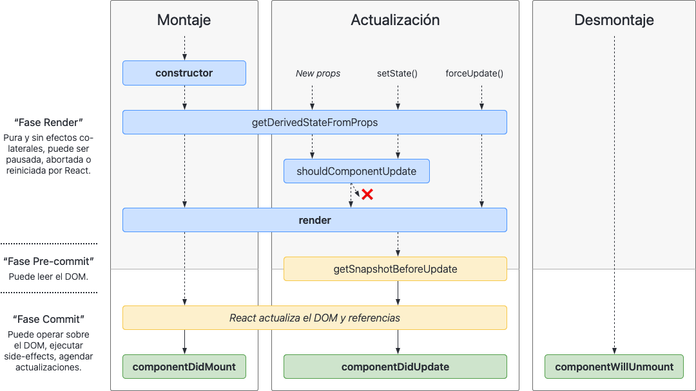

---

title: Evaluando React Context y Redux
datePublished: 2020-11-22 15:20:00

image:
  contentUrl: ./julia-kadel-YmULswIbc3I-unsplash.jpg
  author: Julia Kadel
  description: Russian dolls
  isBasedOn: https://unsplash.com/photos/YmULswIbc3I

tags:
  - react

---

Desde la inclusión de los hooks en React existe el malentendido de que la combinación de los hooks useContext y useReducer sustituye a Redux. [No es cierto](https://blog.isquaredsoftware.com/2018/03/redux-not-dead-yet/).

Recientemente hemos tenido que decidir si debíamos (volver a) utilizar Redux en nuestro proyecto o conservar el useContext que ya estábamos utilizando. En este artículo expondré los puntos que evaluamos y la lógica de nuestra decisión.

En la primera parte introduzco el problema y la soluciones de Context y Redux. En la segunda realizo la comparativa.


## Problema: compartir el estado entre componentes

React se basa en componentes. Idealmente cada componente es independiente de los demás por lo que podemos combinarlos libremente creando componentes más complejos.

Por ejemplo con un par de componentes genéricos podríamos construir un formulario de ingreso:

```tsx
const LoginForm = () => (
  <>
    <Input name="username" ... />
    <Input name="password" ... />
    <Submit ... />
  </>
);
```

Como vemos los componentes se organizan de forma jerárquica (de padres a hijos) pero nos falta algo fundamental: compartir el estado entre ellos.

Volvamos al ejemplo anterior. Necesitamos que los componentes de `Input` sepan cómo comunicarnos cuando el valor inicial ha cambiado y de la misma manera necesitamos que nuestro `LoginForm` comunique cuando estamos listos para hacer el ingreso:

```tsx
const LoginForm = ({ login }) => {
  const [username, setUsername] = useState("");
  const [password, setPassword] = useState("");

  return (
    <>
      <Input
        name="username"
        value={username}
        onChange={setUsername}
      />
      <Input
        name="password"
        value={password}
        onChange={setPassword}
      />
      <Submit onPress={() => login(username, password)} />
    </>
  );
}
```

Vemos a los compontentes compartiendo su `state` a sus hijos por medio de los `props` de estos últimos. De la misma manera necesitan compartir funciones que permitan a sus hijos modificar el estado de su padre.

Es un ejemplo de libro, es decir, refleja el ideal del concepto de componentes. Pero en proyectos reales es sencillo complicar esta estructura.

Por ejemplo imaginemos esta estructura de compontentes:

```tsx
<App>
  <Header>
    <User>
      <ProfileInfo name={profile.name}>
  <Main>
    <ProfileForm>
      <ChangeName name={profile.name}>
```

En esta estructura vemos que el `profile.name` se utiliza en dos componentes "alejados". ¿Cómo podemos compartir el mismo `profile` entre ambos?

La solución más inmediata sería compartir el estado desde padre común entre ambos (`App`) y pasar `profile` "hasta que llegue".

```tsx
<App>
  <Header profile={profile}>
    <User profile={profile}>
      <ProfileInfo name={profile.name}>
  <Main profile={profile}>
    <ProfileForm profile={profile}>
      <ChangeName name={profile.name}>
```

Aunque válido estamos creando otro problema: ahora todos nuestros componentes tienen que recibir y pasar `profile`. En ejemplo anterior podría ser tolerable pero si la estructura fuera de una docena de niveles sería inmanejable.

¿Qué otra opción tenemos? Pasar el `profile` por fuera de la estructura.


### ¿Qué hace el hook useContext?

`useContext` es simplemente un hook que nos permite utilizar los contextos de React. Y los [contextos de React](https://es.reactjs.org/docs/context.html) se definen como:

> Context provee una forma de pasar datos a través del árbol de componentes sin tener que pasar props manualmente en cada nivel.

Justo lo que hablábamos en el punto anterior.

Veamos un posible código para resolver el problema anterior:

```tsx
// src/with-context/AppWithContext.tsx
const INITIAL_PROFILE = {
  name: 'Guest',
};

export const Context = React.createContext(INITIAL_PROFILE);

const AppWithContext: React.FC = () => {
  const [profile, setProfile] = useState(INITIAL_PROFILE);

  return (
    <Context.Provider value={profile}>
      <Header />
      <Main />
    </Context.Provider>
  );
};

export default AppWithContext;
```

y cómo acceder al context desde uno de los componentes:

```tsx
// sr/with-context/ProfileInfo.tsx
import React, {useContext} from 'react';

import { Context } from './AppWithContext';

const ProfileInfo: React.FC = () => {
  const profile = useContext(Context);

  return (
    <p>{JSON.stringify(profile)}</p>
  );
}

export default ProfileInfo
```

### ¿Qué es Redux?

Según su [página oficial](https://es.redux.js.org/):

> Redux es un contenedor predecible del estado de aplicaciones JavaScript.

Quizás no sea una definición muy evidente.

Redux nos plantea en [sus principios](https://es.redux.js.org/docs/introduccion/tres-principios.html) que el estado es díficil de gestionar. Y para hacerlo más sencillo utiliza tres conceptos:

  * store, un único estado que solo puede cambiar con
  * actions, que son eventos de lo que ha pasado y que un
  * reducer, interpreta los actions para cambiar el estado

De esta forma, cuando queremos cambiar el estado hacemos un `dispatch` sobre el `store` con el `action` correspondiente para que el `reducer` decida cuál va a ser el nuevo estado.

Todo esto ocurre fuera de la estructura de React. Por lo que una vez registrado el `store` lo que hacemos es connectar los componentes interesados en los cambios que ocurran.

Plantear un ejemplo aquí sería excesivo. Baste decir que al igual que en el uso del Context necesitamos un proveedor:

```tsx
// src/with-redux/AppWithRedux.tsx
import { Provider } from 'react-redux';

const AppWithContext: React.FC = () => {
  return (
    <Provider store={store}>
      <Header />
      <Main />
    </Provider>
  );
};
```

y que los componentes que estén interesados estarán conectados:

```tsx
const ProfileInfo: React.FC = ({ profile }) => {
  return (
    <p>{JSON.stringify(profile)}</p>
  );
}

const mapStateToProps = (state: any) => ({
  profile: state,
});

export default connect(
  mapStateToProps,
)(ProfileInfo)
```

Para más información os recomiendo comenzar un proyecto con [Redux Toolkit](https://redux-toolkit.js.org/).


## Eligiendo entre React Context y Redux

Tanto React Context como Redux proporcionan un camino para compartir por fuera del árbol de componentes el estado.

Sin embargo, para conseguir este efecto, internamente comparten diferentes cosas:

* Context comparte el `value`, mientras que
* Redux comparte su `store` (que no su estado).

Esta diferencia implica diferentes esfuerzos a la hora de renderizar componentes.


### Re-render en React

Repasemos la teoría de [actualización (re-render) de un componente](https://es.reactjs.org/docs/react-component.html#updating) en React:

> Una actualización puede ser causada por cambios en las props o el estado.

[](https://projects.wojtekmaj.pl/react-lifecycle-methods-diagram/)

Para que React pueda [conciliar los cambios](https://es.reactjs.org/docs/reconciliation.html) el componente necesita volver a renderizar a sus hijos **independientemente de cambiar o no las `props` que comparta con ellos**.

Esto no implica necesariamente repintar en el DOM, ya que para eso esta la concilación, pero [puede seguir siendo un proceso costoso](https://es.reactjs.org/docs/optimizing-performance.html#avoid-reconciliation). En este punto es cuando hablamos de [PureComponet](https://es.reactjs.org/docs/react-api.html#reactpurecomponent), [shouldComponentUpdate()](https://es.reactjs.org/docs/react-component.html#shouldcomponentupdate) y [memo](https://es.reactjs.org/docs/react-api.html#reactmemo).

Volvamos a revisar las implicaciones de Context y Redux.


### ¿Qué ocurre al cambiar cosas?

Vamos a replicar esta estructura:

```tsx
<App>
  <Header>
    <User>
      <ProfileInfo name={profile.name}>
  <Main>
    <ProfileForm>
      <ChangeName name={profile.name}>
```

Y lo haremos dos veces. Una utilizando un `AppWithContext` utilizando React Context y otra `AppWithRedux` utilizando Redux. Puedes consultar todo el código de ejemplo en https://github.com/chernando/context-redux-example

Vamos a hacer una optimización adicional: `Header` va a utilizar `React.memo` para evitar que se renderice si sus props no han cambiado.

En la primera renderización vemos:

```
AppWithContext render - AppWithContext.tsx:21
[Context] Header render - Header.tsx:6
[Context] User render - User.tsx:6
[Context] ProfileInfo render Object { name: "Guest" } - ProfileInfo.tsx:8
[Context] Main render - Main.tsx:6
[Context] ProfileForm - ProfileForm.tsx:6
[Context] ChangeName render Object { name: "Guest" } - ChangeName.tsx:8

AppWithRedux render - AppWithRedux.tsx:21
[Redux] Header render - Header.tsx:6
[Redux] User render - User.tsx:6
[Redux] ProfileInfo render Object { name: "Guest" } - ProfileInfo.tsx:9
[Redux] Main render - Main.tsx:6
[Redux] ProfileForm - ProfileForm.tsx:6
[Redux] ChangeName render Object { name: "Guest" } - ChangeName.tsx:9
```

El comportamiento esperado. Necesitamos a todos los compontentes para poder pintar el estado inicial. Ahora cambiemos el nombre del perfil:

```
[CHANGING PROFILE] Diego - App.tsx:17

AppWithContext render - AppWithContext.tsx:21
[Context] ProfileInfo render Object { name: "Diego" } - ProfileInfo.tsx:8
[Context] Main render - Main.tsx:6
[Context] ProfileForm - ProfileForm.tsx:6
[Context] ChangeName render Object { name: "Diego" } - ChangeName.tsx:8


[Redux] ProfileInfo render Object { name: "Diego" } - ProfileInfo.tsx:9
[Redux] ChangeName render Object { name: "Diego" } - ChangeName.tsx:9
```

Por un lado, vemos que todos los componentes a partir de `AppWithContext`, a excepción de `Header` y su hijo `User`, han tenido que ser renderizados. Y por otro, los componentes a partir de `AppWithRedux` únicamente han renderizado `ProfileInfo` y `ChangeName`, justo los dos que utilizan el estado compartido. ¿Por qué?


### Cambios en Context

`setProfile` provoca un `setState` interno en `AppWithContext`:

```
AppWithContext render - AppWithContext.tsx:21
```

Al forzar la renderización de `AppWithContext` es necesario renderizar a sus hijos:

```
[Context] Main render - Main.tsx:6
[Context] ProfileForm - ProfileForm.tsx:6
[Context] ChangeName render Object { name: "Diego" } - ChangeName.tsx:8
```

Pero el hijo `Header`, al estar envuelto en un `memo` y no cambiar sus props, nos lo saltamos. Por eso no aparece en el listado. Sin embargo `ProfileInfo` al utilizar el contexto es renderizado:

```
[Context] ProfileInfo render Object { name: "Diego" } - ProfileInfo.tsx:8
```

Importante recordar que un cambio en el context [siempre fuerza el renderizado](https://es.reactjs.org/docs/hooks-reference.html#usecontext):

> Un componente que llama a useContext siempre se volverá a renderizar cuando el valor del contexto cambie. Si volver a renderizar el componente es costoso, puedes optimizar esto usando memorización.


### Cambios en Redux

Debido a la estructura de Redux el cambio se realiza internamente en el store por lo que no vamos a ver cambios en el estado del componente que lo contiene. Al no haber cambios en los componentes superiores no es necesario evaluar a sus hijos por lo que tampoco vemos renderizados de los componentes intermedios.

Los componentes hijos, `ProfileInfo` y `ChangeName`, estás subscritos a los cambios que ocurran en el store por lo que han cambiar el estado son despertados, sus props cambian y es necesario renderizarlos:

```
[Redux] ProfileInfo render Object { name: "Diego" } - ProfileInfo.tsx:9
[Redux] ChangeName render Object { name: "Diego" } - ChangeName.tsx:9
```

Importante: En este sencillo ejemplo estamos utilizando **todo** el estado de Redux. **No es la práctica recomendada**. Redux nos permite separar las partes del estado en las que estamos interesados e ignorar los cambios del resto.


## Entonces usar React Context o Redux es cuestión de ahorrar llamadas a render

No. Al menos no completamente.

Recordemos que React concilia el estado interno antes de repintar el interfaz. Comparativamente construir y conciliar el árbol interno es más barato que repintar. En la mayoría de las situaciones no vamos a perder rendimiento.

Pero sí es cierto que realizar render de demás sigue siendo un desperdicio. Dependiendo de la aplicación será más o menos importante.

Además, y como hemos visto en el ejemplo, podemos reducir el número de renderizados [utilizando memo](https://github.com/facebook/react/issues/15156#issuecomment-474590693) entre el componente que incluye el Provider y sus hijos.


## ¿Cuándo debería utilizar React Context y cuándo Redux?

React Context es una herramienta sencilla que puede tener problemas a la hora de optimizar los re-renders. Por lo que se recomienda utilizarlo en [datos que tengan poca frecuencia de actualización](https://github.com/facebook/react/issues/14110#issuecomment-448074060) como podrían ser lo datos del perfil, idioma y tema de una aplicación.

Y en la que deberíamos, por el mismo motivo, evitar construir estados complejos con muchos atributos ya tampoco podemos controlar bien los cambios:

https://twitter.com/dan_abramov/status/1163051479000866816

Redux en cambio es una herramienta más completa, que [nos proporciona](https://blog.isquaredsoftware.com/2018/03/redux-not-dead-yet/#the-future-of-redux):

* Consistent architectural patterns
* Debugging capabilities
* Middleware
* Addons and extensibility
* Cross-platform and cross-framework usage
* Depending on your app's setup, much better performance than working with just Context

Por lo que si necesitamos algo más que solucionar un problema de compartir el estado es cuando deberíamos empezar a considerar Redux.


### Esquema de la toma de decisiones:

* Es un estado que va a ser escrito pocas veces y leído en múltiples componentes
  * Sí: React Context
  * No. ¿Es una estado sencillo (con pocos atributos o una estructura muy plana)?
      * Sí: React Context
      * No: Considera Redux

¿Es razonable mezclar ambos? Sinceramente si tienes la necesidad de utilizar Redux hay pocos motivos para no migrar los contextos que tengas a Redux.


### ¿Qué es lo que hicimos nosotros?

Como comentaba al principio del artículo nosotros en [Zensei](https://zenseiapp.com) tuvimos que enfrentarnos a esta decisión.

En la situación de partida teníamos un único React Context que guardaba el perfil del usuario y su configuración. En principio dos datos parecidos pero que con el tiempo se han ido diferenciado. Por ejempo, uno guarda el nombre del usuario y el otro si había utilizado o no una funcionalidad.

Debido a que en nuestra aplicación utilizamos asistentes para invitar al usuario a conocer nuevas funcionalidades estábamos despertando a casi todos los componentes con el simple hecho de visitar una parte de la aplicación.

Después de repasar toda la información expuesta en este artículo nos dimos cuenta que simplemente necesitamos tener dos contextos separados. Por lo que no necesitamos utilizar Redux. Por el momento.


### Referencias

* https://blog.isquaredsoftware.com/2018/03/redux-not-dead-yet/
* https://blog.isquaredsoftware.com/2020/01/blogged-answers-react-redux-and-context-behavior/
* https://github.com/facebook/react/issues/14110#issuecomment-448074060
* https://projects.wojtekmaj.pl/react-lifecycle-methods-diagram/
