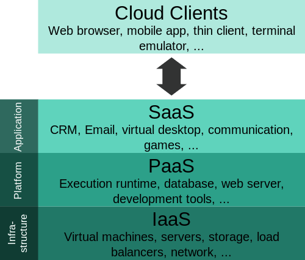
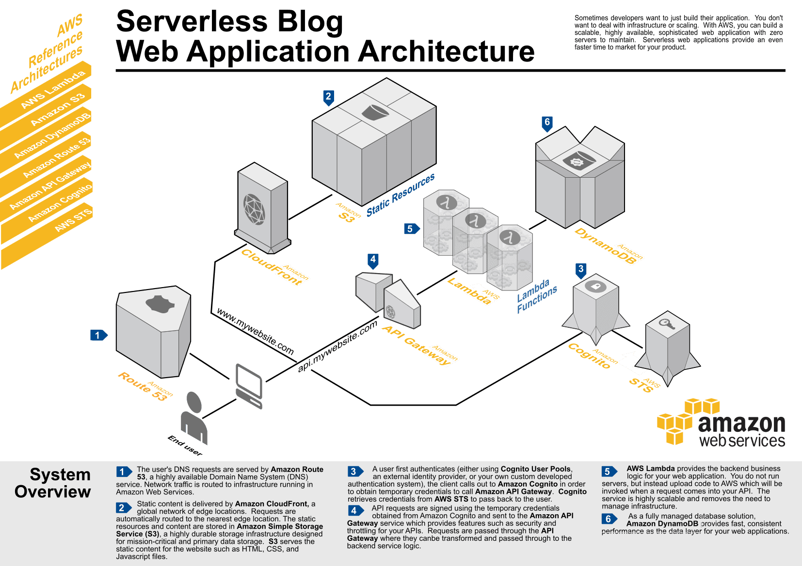

En Agosto de 2006 Amazon anuncia su [beta de EC2](https://aws.amazon.com/es/blogs/aws/amazon_ec2_beta/) y pocos años después la **computación en la nube** se convierte en una pieza fundamental. En Noviembre de 2014 AWS [anuncia Lambda](https://www.youtube.com/watch?v=9eHoyUVo-yg) y en 2017 **Serverless** ya es la segunda [plataforma más querida por los desarrolladores](https://stackoverflow.com/insights/survey/2017#technology-most-loved-dreaded-and-wanted-platforms). ¿Pero qué es Serverless?

Siempre he entendido mejor las cosas separando cada pieza y comprendiendo su motivación. Repasemos brevemente cómo ha evolucionado el desarrollo en la nube.

## La evolución de los *aaS

La computación en la nube es en realidad alquilar servidores de otros. Se nos ofrece como una versión virtual por lo que no se nos entrega nada físico. Llamamos a este modelo _Infrastructure as a Service_ (IaaS) y nos provee de servidores, almacenamiento y red de comunicaciones que gestionaremos a nuestro gusto. El ejemplo más clásico es [AWS EC2](https://aws.amazon.com/es/ec2/).

Sin embargo la configuración y el mantenimiento de la infraestructura conlleva costes. Para evitar estos costes surge la siguiente generación: _Platform as a Service_ (PaaS). Se nos ofrece un entorno gestionado en el que desplegar nuestro software, limitando nuestra responsabilidad al desarrollo. El mejor promotor es [Heroku](https://www.heroku.com/).

Por último tenemos el más común de los modelos y que usamos como usuarios en el día a día: _Software as a Service_ (SaaS). Al ser usuarios finales no tenemos que preocuparnos ni de su desarrollo ni de su despliegue. [G Suite](https://gsuite.google.com/) cubre la mayoría de las necesidades ofimáticas de empresa.

[](https://commons.wikimedia.org/wiki/File%3ACloud_computing_layers.svg)

## BaaS, un concepto que quizás se nos escapó

Con la llegada de las aplicaciones para smartphones cambiamos nuestra forma de desarrollar. Necesitamos una separación entre la aplicación (parte expuesta al usuario) y el backend (parte no expuesta al usuario).

Teniendo esta separación, la aplicación puede apoyarse en nuestro backend o en cualquier otro. Con esta posibilidad y trayendo el concepto de SaaS creamos _Mobile Backend as a service_ (MBaaS). La diferencia sútil es que este SaaS no se ofrece al usuario, se ofrece al desarrollador.

Esta separación también trae cambios a la forma de desarrollar aplicaciones web y vemos como los frameworks de Single-page Application (SPA) cobran protagonismo. Hasta el punto que MBaaS se convierte en simplemente BaaS y aparecen las primeras aplicaciones web sin servidores.

En esta sección tenemos a [Firebase](https://firebase.google.com/) que demuestra como funcionalidades como la auntenticación, persistencia, etc. son fácilmente delegables e integrables como servicios externos.

## FaaS, ejecución de código como servicio

En nuestro afán por reducir costes centramos el desarrollo en su mínima expresión: la función. Nos limitamos a codificar el comportamiento de esta función y un sistema externo se encargará de ejecutarla en el momento adecuado. Tenemos _Function as a Service_ (FaaS).

¿Cuáles son sus ventajas?

- Toda la infraestructura está delegada, sin configuraciones ni mantenimientos.
- Es escalable, el proveedor se encarga de satisfacer nuestra demanda.
- Se cobra por consumo de forma lineal, si no se utiliza no se paga.

¿Y sus desventajas?

- Los entornos de programación (lenguajes, librerías, etc.) están límitados por el proveedor.
- Es un servicio sin estado, cualquier operación que requiera "recordar" entre ejecuciones ha de apoyarse en otros servicios.
- Al cobrarse por tiempo de ejecución, y en algunos provedores limitarse, se penaliza un consumo prologando en el tiempo.

Veamos como sería un ejemplo de "Hola mundo" en AWS Lambda con JavaScript:

```javascript
exports.myHandler = function (event, context, callback) {

  console.log('Hello World!')

  callback(null, 'OK')
}
```

No vamos a detallar cómo funciona AWS Lambda. Simplemente destacar que implementando la función con la firma `(event, context, callback)` está listo para que AWS ejecute nuestro código. 

Para ver cómo se desplegaría esta función puedes echar un vistazo al tutorial [Create a HelloWorld Lambda Function](https://docs.aws.amazon.com/lambda/latest/dg/getting-started-create-function.html).

## Ya tenemos todas las piezas ¿qué es Serverless?

Es difícil encontrar dos definiciones de Serverless iguales. Sin embargo, conociendo los objetivos de BaaS y FaaS podemos comprenderlo mejor como la combinación de ambos.

Por un lado disponemos de una serie de servicios externos que nos proporcionan:

- Autenticación como [Auth0](https://auth0.com/) o [Amazon Cognito](https://aws.amazon.com/es/cognito/).
- Bases de datos NoSQL como [Firebase Realtime Database](https://firebase.google.com/docs/database/?hl=es) o [DynamoDB](https://aws.amazon.com/es/dynamodb/).
- Almacenamiento como [Firebase Storage](https://firebase.google.com/docs/storage/?hl=es) o [Amazon Simple Storage Service](https://aws.amazon.com/es/s3/).
- Envío de correos electrónicos como [Mandrill](http://www.mandrill.com/) o [Amazon Simple Email Service](https://aws.amazon.com/es/ses/).
- Websockets como [Pusher](https://pusher.com/) o [Socketize](https://socketize.com/).
- Etc.

Y por otro, disponemos de ejecución de funciones como:

- [AWS Lambda](https://aws.amazon.com/es/lambda/).
- [Google Cloud Functions](https://cloud.google.com/functions/).
- [Azure Functions](https://azure.microsoft.com/es-es/services/functions/).

Juntando las piezas adecuadas podemos limitar nuestro esfuerzo a "rellenar" funciones que cubran la lógica de nuestro negocio. Sin mantener una infraestructura propia, reduciendo tiempos de desarrollo y, posiblemente, costes operativos.

Si eres aficionado al [Domain-Drive Design](https://es.wikipedia.org/wiki/Dise%C3%B1o_guiado_por_el_dominio) verás que el planteamiento es similar. Los esfuerzos se centran en el dominio principal y se externalizan los dominios genéricos.

El siguiente ejemplo muestra una arquitectura Serverless sobre AWS, [código Java incluído](https://github.com/awslabs/lambda-refarch-webapp). Destacar que solamente nos preocupamos por las funciones Lambda y el resto son servicios gestionados.




## ¿Es Serverless _la_ bala de plata?

No. Como toda tecnología es adecuada para ciertos problemas y no para otros.

Revisemos algunas de sus limitaciones:

- Vendor lock-in: resulta complicado migrar de un proveedor a otro.
- Limitación del tiempo máximo de ejecución de una función.
- Limitación del tamaño máximo de la función.
- Latencia inicial: es posible que la ejecución sufra latencias si es su primera ejecución o si lleva tiempo sin ejecutarse.
- Entorno cerrado y gestionado por otros: no podemos realizar personalizaciones ni optimizaciones.

El principal problema es la pérdida de control cuando el número funciones crece. Por ejemplo, si nuestro producto se puede desgranar en 100 funciones invocables ¿cómo gestionamos sus diferentes versiones? ¿cómo mantenemos las dependencias entre ellas? ¿cómo hacemos los pases a producción?.

Por el momento nos faltan herramientas para poder gestionar cómodamente este tipo de arquitecturas. Herramientas que nos ayuden a empaquetar, versionar, desplegar, monitorizar, testear, etc. Mención especial para [Serverless Framework](https://serverless.com/) que está convirtiéndose en esta herramienta.

## Serverless, una tecnología en alza

En mi opinión Serverless presenta muchísimo potencial. Con el tiempo vamos a disponer de más BaaS y más especilizados. Y cada vez más vamos a ver el valor en cómo agregamos esos servicios, en vez de reimplementarlos.

En cuanto a su puesta en producción es una tecnología con una curva de aprendizaje bastante suave y resulta sencillo desplegarla. Plantear una migración hacia este tipo de arquitectura puede realizarse de forma más escalonada de lo que podría ser una migración a microservicios. Aunque como siempre lo recomendable es empezar con algo nuevo, no crítico y sensiblemente pequeño.

Mi intención es seguir profundizando en esta arquitectura y (con algo de suerte) seguir escribiendo 😉

## Otras fuentes

- [AWS Lambda Makes Serverless Applications A Reality](https://techcrunch.com/2015/11/24/aws-lamda-makes-serverless-applications-a-reality/) por [Ron Miller](https://twitter.com/ron_miller).
- [What is serverless](https://auth0.com/blog/what-is-serverless/) por [Tomasz Janczuk](https://twitter.com/tjanczuk).
- [Serverless Architectures](https://martinfowler.com/articles/serverless.html) por [Mike Roberts](https://twitter.com/mikebroberts).
